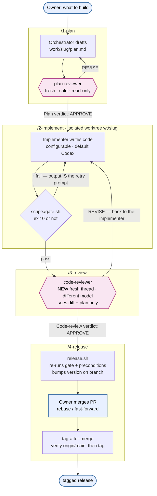
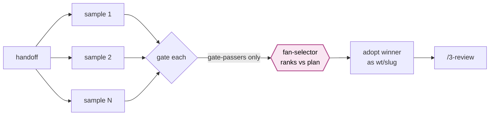

# agentic-coding

A small, opinionated framework for building software with AI agents — where **no agent is ever trusted to check its own work.**

One Claude Code session acts as the **Orchestrator**: it plans, dispatches, and drives the loop. Every stage that could go wrong is checked by a *different* agent — a fresh thread, cold context, often a different model — and by a deterministic shell gate that no agent can talk its way past. The human is the **Owner**: they set direction and merge.

No custom runtime. No ceremony that doesn't catch a defect.

---

## The loop

```
/1-plan  →  /2-implement  →  /3-review  →  /4-release
```

Each stage produces an **artifact** (a plan, a diff, a release commit), and each artifact is handed to an independent checker before it advances. Feedback flows *backward* until the checker is satisfied; work only moves *forward* on an explicit verdict.



`{{hexagons}}` are the **adversarial checkpoints** — an agent whose only job is to try to break the previous agent's work. Blue nodes are the **Owner**. Everything else is the Orchestrator driving deterministic machinery.

Trivial fixes (typos, one-liners, config tweaks) skip the loop — you just do them on a branch. The loop is for work with enough surface area to get wrong.

---

## Why the agents grill each other

The core bet of this framework: **a single agent grading its own output is the weakest link in the pipeline.** It has already committed to an approach, it has the same blind spots on review as it had on write, and it is motivated to declare victory. So the framework never lets that happen. Three independent forces have to agree before anything ships:

**1. Writer ≠ reviewer, mechanically.** Reviews come only from subagents defined in `.claude/agents/` — with **read-only tools**, so a reviewer *cannot* quietly fix what it finds; it can only report. The Orchestrator that dispatched the work never reviews that work. This isn't a guideline in a prompt; it's enforced by which tools each agent is handed.

**2. Fresh, cold context defeats anchoring.** Every review runs in a brand-new thread that has never seen the implementation conversation — it gets *only* the diff and the plan. A reviewer that watched the code being written is already anchored to its reasoning; one that sees just the result asks "does this actually match the plan?" from scratch. Re-reviews after a fix get *another* new thread, because a reviewer that already approved a direction is compromised on the next pass.

**3. A different model breaks correlated blind spots.** The implementer, the reviewers, and the selector can each run a different model (set per role in `config.yaml`). A bug the writer's model can't see is often obvious to a different one. Same-vendor agreement is corroboration, not proof — so the deterministic gate carries the real weight, and agent agreement backs it up.

**And above all of them sits a script.** `scripts/gate.sh` exits `0` or it doesn't. No agent — Orchestrator or reviewer — can overrule it, reinterpret it, or call work "done" while it's red. When it fails, its output *is* the prompt fed back to the implementer. Judgment lives in the agents; the pass/fail decision lives in code.

> **Why this pays off:** the gate and the reviewers catch *different classes* of defect. The gate catches what's mechanically checkable — a lint error, a broken test, a shellcheck warning. The adversarial reviewer catches what a passing gate can hide: an edge case with no test, a plan requirement quietly unmet, a shell idiom that works on the author's machine and breaks on bash 3.2. Neither alone is enough. Rounds of an independent agent *trying to break* green code routinely surface real bugs the gate signed off on — which is exactly the point of making them argue.

---

## Best-of-N implement (opt-in)

For high-value work units, `/2-implement` can run **N implementer samples, each in its own isolated worktree**, drop the ones that fail the gate, and have a fresh `fan-selector` agent pick the winner by plan-fit — another instance of the same principle: generate diversity, then filter it through an independent judge. (Dispatch is sequential, so N > 1 costs N× wall-clock, not just N× tokens.)



It's off by default (`implementer.fan: 1` — byte-for-byte the single-agent path). Set N > 1 only when the extra implementer tokens are worth it. It reduces per-run *variance*; it does **not** replace cross-model review.

---

## Design rules

1. **Writer never reviews** — enforced by fresh subagent threads with read-only tools, not by prose.
2. **The gate is deterministic** — agents don't argue with exit codes; failure output *is* the retry prompt.
3. **Implementation happens in worktrees** — never in the main checkout; `scripts/worktree.sh` manages them.
4. **Artifacts flow, not transcripts** — reviewers see the diff and plan, never the implementation conversation.
5. **Release is a script** — `scripts/release.sh` owns every precondition as an exit code; it never pushes and never touches `main`. Tagging happens only after the PR merges, and only if the merged commit *is* the release commit.
6. **Context is tiered** — hot (`CLAUDE.md` + `ARCHI.md` + `PLAN.md`, ~300 lines total), warm (active skill + profile), cold (`knowledge/`, loaded on citation, starts empty).
7. **Vendor names live in `config.yaml` only** — swap the implementer or any reviewer model by editing one line.

---

## Layout

```
CLAUDE.md            orchestrator constitution — the rules above, authoritative (hot)
ARCHI.md             architecture snapshot, regenerated by /compact, never groomed (hot)
PLAN.md              one screen: objective, now, decisions, risks (hot)
AGENTS.md            the implementer's contract

config.yaml          the one knob: profile, model per role, implementer command, gate + worktree settings

skills/              the loop as skills:
                       1-plan · 2-implement · 3-review · 4-release · init · compact
                       (1-plan & 2-implement carry prompts/*.tpl)
.claude/agents/      the checkers (read-only, own models, cold context):
                       plan-reviewer · code-reviewer · fan-selector
scripts/             the deterministic layer:
                       gate.sh        stack-detecting pass/fail
                       worktree.sh    isolated-checkout lifecycle
                       agent-exec.sh  dispatch the implementer into a worktree
                       fan-exec.sh    best-of-N dispatch + winner adoption
                       release.sh     preconditions, version/changelog, tag-after-merge
                       gate.d/*.sh    project-specific gate extensions
profiles/            software · machine-learning · database · work — add slots, never override
work/<slug>/         one directory per work unit: plan.md, handoff.md, notes.md
VERSION / CHANGELOG  CalVer + Keep-a-Changelog, written only by release.sh
knowledge/           cold-tier reference docs — earned, not designed (starts empty)
```

---

## Getting started

1. Use this repo as a template, or copy it into an existing project.
2. Open it in Claude Code and run `/init` — it scans the codebase, generates `ARCHI.md`, sets the profile, and verifies the gate runs.
3. Start work: `/1-plan <what you want>`, then follow the loop.

## Requirements

- **Claude Code** — the Orchestrator and the reviewer subagents.
- **An implementer CLI** — default `codex`; set `implementer.command` in `config.yaml` to use anything else (including Claude Code itself).
- **`git`, `bash`**, and whatever your project's gate needs (`shellcheck`, `ruff`, `pytest`, `cargo`, `go`, …). The gate auto-detects the stacks present.
